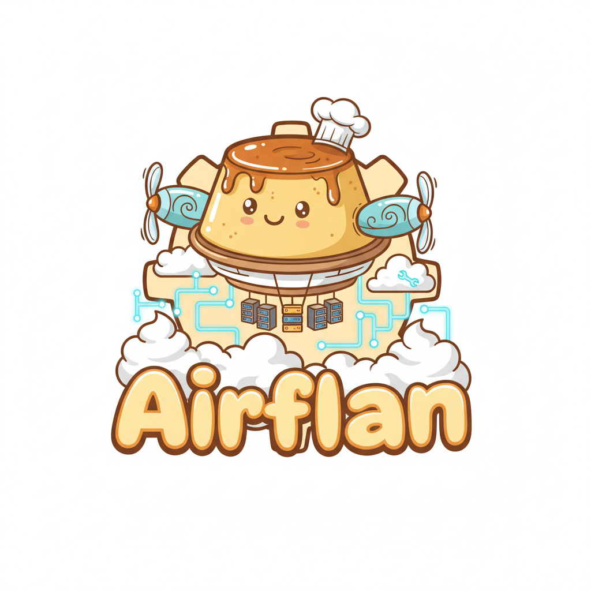

# AirFlan

<p align="center">
  
</p>

** Workflow Orchestration for Python**

AirFlan is a lightweight, modular, and robust workflow orchestrator designed for building complex data pipelines with ease. It combines a simple Pythonic API with powerful enterprise features like parallel execution, caching, retries, and a state-of-the-art monitoring dashboard.

---

## Features

*   **DAG Orchestration**: Automatically resolves dependencies and executes tasks in topological order.
*   **Parallel Execution**: True parallel task processing using thread pools.
*   **Robust Error Handling**: Built-in retries, timeouts, and error propagation.
*   **Smart Caching**: Avoid redundant computation with result caching.
*   **Context Sharing**: Thread-safe data passing between tasks.
*   **🧪 Experiment Tracking**: Native MLOps capabilities with metrics, parameters, and artifact logging.
*   **Enterprise UI**: A professional, minimalist dashboard for real-time monitoring and visualization.
*   **Modular Architecture**: Extensible design with pluggable executors and storage backends.

## Installation

1.  Clone the repository:
    ```bash
    git clone https://github.com/yourusername/airflan.git
    cd airflan
    ```

2.  Install dependencies:
    ```bash
    pip install -r requirements.txt
    ```

### Local Development (Editable Install)

If you want to use AirFlan in another project locally without publishing to PyPI:

1.  Navigate to your **other project's** directory.
2.  Install AirFlan in editable mode:
    ```bash
    pip install -e /path/to/cloned/airflan
    ```
    *(Replace `/path/to/cloned/airflan` with the actual path to this repository)*

## Quick Start

Define your workflow using the simple decorator API:

```python
from airflan import WorkflowOrchestrator, WorkflowContext

# Initialize
wf = WorkflowOrchestrator(name="data_pipeline")

# Define Tasks
@wf.task(name="extract")
def extract_data():
    return [1, 2, 3]

@wf.task(name="process", depends_on=["extract"])
def process_data(context: WorkflowContext):
    # Access upstream data or shared context
    return "Processed"

# Run
if __name__ == "__main__":
    wf.run(parallel=True, enable_ui=True)
```

## Monitoring Dashboard

AirFlan includes a professional real-time monitoring dashboard built with Streamlit.

To launch the UI, simply run your workflow with `enable_ui=True`. The dashboard provides:
*   **Interactive DAG**: Visualize your workflow structure.
*   **Real-time Metrics**: Track running, completed, and failed tasks.
*   **Execution Logs**: Live stream of task logs.
*   **Performance Stats**: Task duration and status distribution.

## 🧪 Experiment Tracking (NEW!)

AirFlan now includes native experiment tracking for MLOps workflows! Track metrics, parameters, and artifacts just like MLflow or W&B, but fully integrated with your workflows.

### Quick Example

```python
# Enable experiment tracking
wf = WorkflowOrchestrator(
    name="ml_training",
    experiment_name="mnist_classifier"  # ← Enable tracking!
)

@wf.task(name="train")
def train_model(context: WorkflowContext):
    # Log hyperparameters
    context.log_params({"lr": 0.001, "batch_size": 32})
    
    # Log metrics during training
    for epoch in range(10):
        loss = train_one_epoch()
        context.log_metric("loss", loss, step=epoch)
    
    # Save artifacts
    torch.save(model, "model.pth")
    context.log_artifact("model.pth", artifact_type="model")
```

### View Experiments Dashboard

```bash
streamlit run airflan/ui/experiments_dashboard.py
```

Features:
*   📊 **Metrics Visualization**: Interactive charts for training curves
*   ⚙️ **Parameters Tracking**: Compare hyperparameters across runs
*   📦 **Artifact Management**: Save and browse models, plots, data
*   📈 **Run Comparison**: Side-by-side comparison of multiple experiments

See [`docs/experiment_tracking.md`](docs/experiment_tracking.md) for the complete guide!

## Project Structure

```
AirFlan/
├── airflan/                  # Core Library
│   ├── core/                 # Task, Scheduler, Executor, Context
│   ├── storage/              # Cache & State Management
│   ├── mlops/                # Experiment Tracking (NEW!)
│   ├── ui/                   # Dashboards
│   └── orchestrator.py       # Main Entry Point
├── demo_workflow.py          # Example Enterprise Pipeline
├── demo_ml_experiment.py     # ML Experiment Tracking Demo (NEW!)
└── requirements.txt          # Dependencies
```

## Advanced Usage

Check out the docs for detailed guides:
*   `docs/how_to.md` - Sequential vs. Parallel Execution, Context Management, Retry Policies, Caching
*   `docs/experiment_tracking.md` - Complete MLOps experiment tracking guide (NEW!)

## License

MIT License
